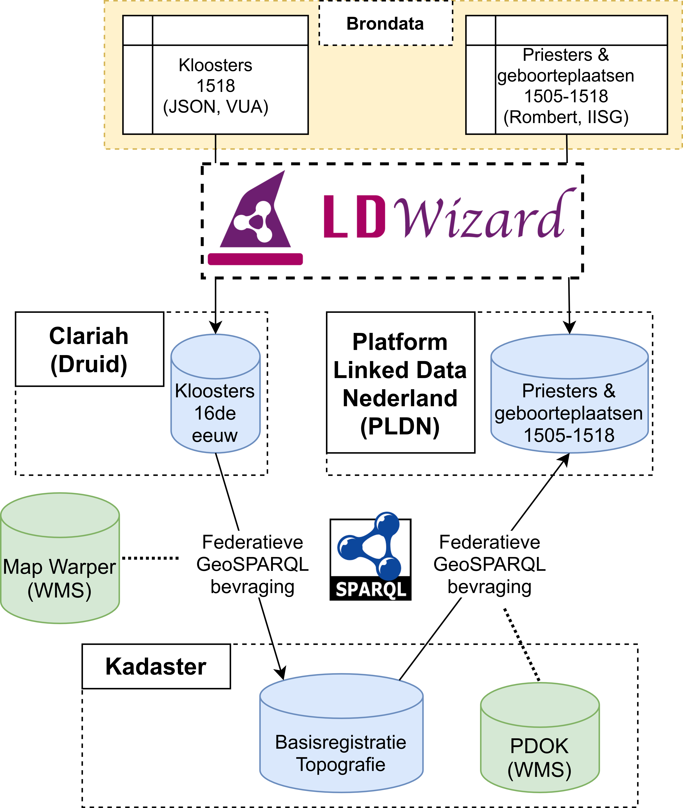

# geoconnectables or mapping the priests: connecting 8 major LOD suppliers

In this data story, we are going to show how you can combine tools from 8 major institutes and networks into a single *pipeline to visualize* data from a CSV onto a map image, whilst offering it as Linked Open Data. For interactive versions of this data story visit:
- [Kadaster labs](https://data.labs.kadaster.nl/kadaster-dev/-/stories/hack-a-little)
- [Druid](https://druid.datalegend.net/dataLegend/-/stories/hack-a-little)

## Starting in the 16th century...
A long time ago in a galax..., well actually in this galaxy and in a place that we call 'The Netherlands', at least nowadays... What we now from that era may not be a lot, but for an important group of people, those who would rise in the ranks of religious orders we know quite a lot. For example, we know, where they were born... and that might be a little more interesting than you'd expect... because was faith random? Did the divine call spread evenly across the country? Or were those of the cloth born, in the vicinity of churces, where the influence of religious orders was strong.

## Step 1: transpose CSV to Linked Data
The first thing we did was to create Linked Data from a [CSV](https://github.com/CLARIAH/geoconnect/blob/main/reference_priest_data.txt) file using the [LDWizard](https://ldwizard.netwerkdigitaalerfgoed.nl/1) a tool brought to you by the [Dutch Digital Heritage Network](https://www.netwerkdigitaalerfgoed.nl). Please see this [demo](https://www.youtube.com/watch?v=VO61pqKWw7A) on how you can do it yourself.

One really cool feature of the LDWizard is that through its design everyone can create their own 'flavour' of LDWizard. For this [Hack-a-LOD](https://hackalod.com) Jorrit from Kadaster created a geo-flavoured LDWizard, that allows you to directly transpose geo coordinates into properly defined Linked Data. Make sure you [watch his demo](https://youtu.be/6V7ejBSCpH8?t=24). This allows us to easily visualize data and to perform geo related sparql queries, for example whether something is close to something else. 

This feature proved to be crucial: our 16th century place names, did not at all resemble contemporary place names: e.g. "Oculo" back then, is "Schiermonnikoog" now. Now your average regex excercise...

## Step 2: match via geographic proximity
So in order to relate anything contemporary to our 16th century data, we decided to match the historical places based on their geographic location to contemporary places. For the contemporary places we used Kadaster's [BRT](https://www.kadaster.nl/zakelijk/registraties/basisregistraties/brt) which is already available via this [endpoint](https://data.labs.kadaster.nl/kadaster-dev/-/queries/). We uploaded the geo-LDWizard RDF representation of the birthplaces csv file to an instance of [TriplyDB](https://triplydb.com). As a result we could write a federated query, retrieving both contemporary and historical information on the birth places of priests. 

__Query__: See this [example query](https://data.labs.kadaster.nl/kadaster-dev/-/queries/Find-a-Dutch-place-for-a-given-point/9), for Schiermonnikoog.

## Step 3: eye candy or not
When presenting historic map visualizations an often heard complaint at conference is that contemporary maps are ugly (or even 'evil') as layer for the actual visualization. And to be fair, especially in the case of the Netherlands, it is awkward to read place names, see bridges and highways, where 500 years ago, there was nothing but sea. It cast a shadow on the accuratess of the academic work.

Now there are ton of tools that dealt with this problem, and actually a very good one is QGIS. But even QGIS requires, well.. QGIS yet another tool in the pipeline. So instead, [Triply](https://triply.cc) brought a new feature to their triple store, that allows you to use maps as underlays, as long as these maps are provided as a WMS service from a secure website (https://). This even works, when you don't have access to the triplestore, via a federated query. So how do we get a map?

Well, to my knowledge orginating from the New York Public Library, mapwarper is a very decent piece of tooling that allows you to host maps, georeference them and provde them as .kml and WMS (amongst others). For our use case, we decided to pick a map that probably qualifies for the golden raspberry amongst maps: https://mapwarper.net/maps/40981. That said, many kudos to mapwarper.net for providing this excellent service and don't forget to [donate](https://paypal.me/timdevelops) to this good cause. So brace your eyes, here goes map overlaying via SPARQL:

__Query__: See this [example query](https://stories.triply.cc/wms-playground/#query=prefix%20geo%3A%20%3Chttp%3A%2F%2Fwww.opengis.net%2Font%2Fgeosparql%23%3E%0Aselect%20%3FmapName%20%3FmapEndpoint%20%3Fwkt%20%3Fwkt2%7B%0A%20%20bind(%22Polygon((3.37087%2050.7539%2C3.37087%2053.4658%2C7.21097%2053.4658%2C7.21097%2050.7539%2C3.37087%2050.7539))%22%5E%5Egeo%3AwktLiteral%20as%20%3Fwkt).%0A%20%20bind(%22https%3A%2F%2Fmapwarper.net%2Fmaps%2Fwms%2F40981%3Frequest%3DGetCapabilities%26service%3DWMS%26version%3D1.1.1%22%20as%20%3FmapEndpoint)%0A%7D%0A&endpoint=https%3A%2F%2Fapi.labs.kadaster.nl%2Fdatasets%2FEirikKultorp%2Fmetadata-replaced-11-11-2020%2Fservices%2Fmetadata%2Fsparql&requestMethod=POST&tabTitle=Query%203&headers=%7B%7D&contentTypeConstruct=text%2Fturtle%2C*%2F*%3Bq%3D0.9&contentTypeSelect=application%2Fsparql-results%2Bjson%2C*%2F*%3Bq%3D0.9&outputFormat=geo&outputSettings=%7B%22map%22%3A%22nlmaps%22%2C%22visualization%22%3A%22vanilla%22%2C%22activeLayers%22%3A%5B%22base%22%2C%22aardgas_buurt_bedrijven_2014%22%2C%22MapWarper%22%5D%7D)

## Warping time by 502 years: 1518-2020 what's left of the Monestaries?

So, thus far we have recovered the places that priests are coming from and how we call those places now. But what about their religious institutions? What has become of those? To answer that question we use the 16th century coordinaates of the locations of the monestaries and retrieve from the BRT what currently lies at that point: fastforwarding 500+ years in one federated query.

__Query__: See this [example query](https://druid.datalegend.net/dataLegend/-/queries/kloosters-toen-kadaster-nu/1)

## Wrapping the mapping
So far, in over four years of hack-a-LODS the focus was always on a telling an important data story. The Hack-a-LOD has been of crucial importance to the (Duthc) LOD community and as a result, this year, we felt things have matured enough to tell a story about the networks themselves. There are now so many components in place, that we are able to exchange tools and information from a variety of networks and suppliers, without the need of adding much ourselves. To sum up: source data are provided by the IISG, VU; the Linked Data by Kadaster, the newly LDWizard derived LOD is hosted by CLARIAH and PLDN, while the maplayers are provided by Mapwarper and PDOK, whilst Triply provided the WMS to SPARQL demonstrator.

